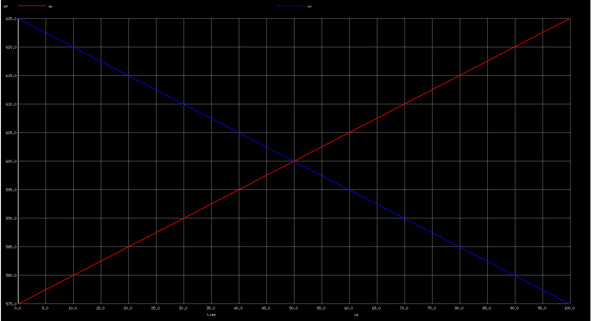
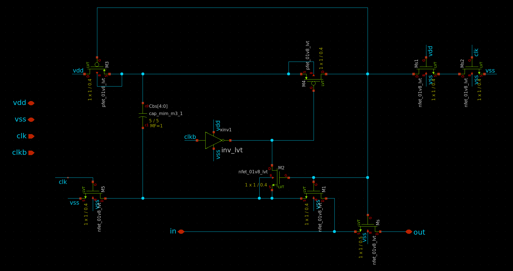
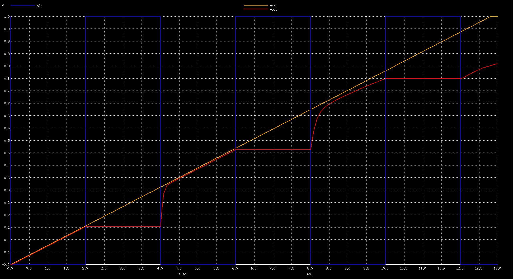
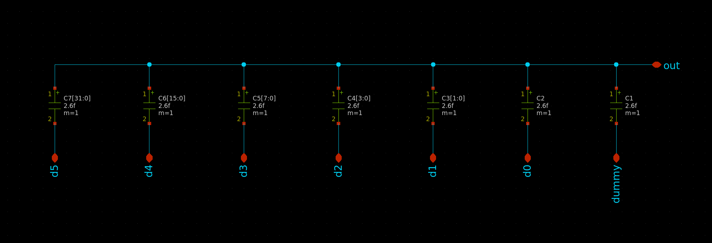

# mpw7 project
# 10bit sar adc

This project is the implementation of a 10bit sar adc using Skywater 130nm technology.
The purpose of this project is to test the open source tools provided with the PDK and to go through all the steps of the analog design flow.

## Dynamic Comparator
The schematic of the dynamic comparator was deisgned as follows :

The simulation result of the comparator test bench was deisgned as follows :

## Sampling Clock Bootstrap Circuit
The schematic of the sample-and-hold test bench was deisgned as follows :

The simulation result of the sample-and-hold test bench was deisgned as follows :

## CDAC (capacitor digital-to-analog converter)
The schematic of the cdac test bench was deisgned as follows :

